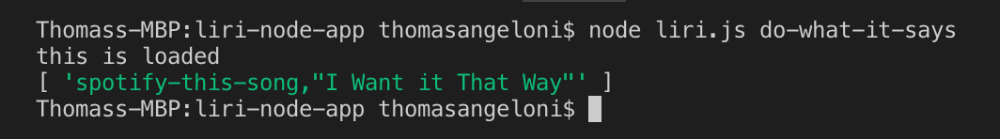

# LIRI Bot App

Language Interpretation and Recognition Interface that allows users to input simple text commands.

LIRI will search for concerts, movies, and song information with simple commands:

    `concert-this`

    `spotify-this-song`

    `movie-this`

    `do-what-it-says`

## Built With:

    Visual Studio Code (https://code.visualstudio.com) - Text editor
    
    Javascript
    
    Node.js (https://nodejs.org/en) - Framework used
    
    JSON (http://www.json.org) - Data format used
    
    Axios
    
    Moment
    
    DotEnv
    
    BandsInTown API (http://www.artists.bandsintown.com/bandsintown-api) - API for Concerts
    
    Spotify API (https://developer.spotify.com/documentation/web-api) - API for music
    
    OMDB API (http://www.omdbapi.com) - API for movies

# Demo of functioning app:

   Bands In Town: `node liri.js concert-this '<artist name here>'`
   
        Screenshot:

   
   Spotify: `node liri.js spotify-this-song '<song name here>'`

        Screenshot:
        
        
   
   
   OMDB: `node liri.js movie-this '<movie name here>'`

        Screenshot:
        
        

   Do What it Says: `node liri.js do-what-it-says'

        Screenshot:
        
        

   How data is formatted when appended to log.txt file:

        Screenshot:
        
        

   Error Response:

        Screenshot:
        
        

   
